<!-- ========================================================= -->
<!--                    YUKTA TIWARI                           -->
<!--             GitHub Profile README                        -->
<!-- ========================================================= -->

<!-- ======================= HERO ============================ -->

 

  

  

---

## ⚡ THE DEVELOPER BEHIND THE CODE

**Full-Stack Engineer • Backend Explorer • System Design Enthusiast**

 

I don't just build interfaces.  
I like understanding **what happens behind them.**

 

`Authentication` · `APIs` · `Transactions` · `Caching` · `Security` · `Deployment`

 

| 🧠 | WHAT I'M INTO |
|:---:|:---|
| ⚡ | Full-Stack Development |
| 🏗️ | Backend Architecture |
| 🔐 | Authentication & Security |
| 💳 | Transaction Systems |
| 🚀 | Scalable APIs |
| 🌐 | Distributed Systems |
| 🤖 | AI Engineering |

---

# 🏗️ CURRENTLY BUILDING

### 💳 Digital Wallet & Payment Platform

**A full-stack financial system exploring real backend engineering problems.**

 

 

### What makes it interesting?

<table>
<tr>
<td>🔐 <b>Authentication</b> JWT • Cookies • RBAC • Refresh Tokens</td>
<td>💳 <b>Transactions</b> Ledger Accounting • Idempotency</td>
</tr>

<tr>
<td>⚡ <b>Redis</b> Cache • Rate Limiting • Idempotency</td>
<td>🛡️ <b>Security</b> Race Protection • Audit Logging</td>
</tr>

<tr>
<td>📄 <b>KYC</b> Document Upload • Admin Approval</td>
<td>🐳 <b>Infrastructure</b> Docker • MongoDB • Redis</td>
</tr>
</table>

---

# 🚀 FEATURED PROJECTS

<table>
<tr>

<td width="50%" valign="top">

## 💳 LedgerPay

**Digital Wallet Platform**

Backend-focused financial system exploring ledger accounting, secure transactions, Redis, RBAC, KYC and Docker.

 

`React` `Node.js` `Express`  
`MongoDB` `Redis` `Docker`

 

</td>

<td width="50%" valign="top">

## 🤖 AI Interview

**AI Interview Platform**

AI-powered interview platform with generated interviews, scoring, feedback, transcripts and candidate analysis.

 

`Next.js` `TypeScript`  
`MongoDB` `AI`

 

</td>

</tr>

<tr>

<td width="50%" valign="top">

## ✈️ Ombreille

**Hospitality • Aviation • Real Estate**

Premium MERN web experience with responsive UI, cloud media and production deployment.

 

`React` `Node.js` `Express`  
`MongoDB` `Cloudinary`

 

</td>

<td width="50%" valign="top">

## 🔗 LinkFlow

**URL Shortening Platform**

Exploring a non-MERN architecture with URL shortening, redirects, PostgreSQL and backend design.

 

`React Native` `Expo`  
`PostgreSQL` `Node.js`

 

</td>

</tr>
</table>

---

# 🧠 TECHNOLOGY STACK

### FRONTEND

  

### BACKEND

  

### DATABASE & INFRASTRUCTURE

  

### TOOLS

---

# 📊 GITHUB ANALYTICS

 

---

# 🛰️ GITHUB COMMAND CENTER

  

---

# 📦 PROFILE NUMBERS

---

# 🌱 CURRENTLY LEARNING

<table>
<tr>

<td align="center">
<h3>🏗️</h3>
<b>System Design</b>
</td>

<td align="center">
<h3>🌐</h3>
<b>Distributed Systems</b>
</td>

<td align="center">
<h3>⚡</h3>
<b>Redis</b>
</td>

<td align="center">
<h3>📨</h3>
<b>Message Queues</b>
</td>

<td align="center">
<h3>🔐</h3>
<b>Security</b>
</td>

<td align="center">
<h3>🤖</h3>
<b>AI Engineering</b>
</td>

</tr>
</table>

---

# 🧪 WHAT I'M EXPLORING

`Scalable APIs`  
`Caching Strategies`  
`Idempotency`  
`Race Conditions`  
`RBAC`  
`Audit Systems`  
`Docker`  
`Transaction Queues`  
`Offline Systems`  
`Hybrid Cryptography`

---

# 💀 THE CHAOS CORNER

### I said:

"I'll just add one small feature."

The feature:

  <strong>Authentication</strong>
  ↓
  <strong>Redis</strong>
  ↓
  <strong>Rate Limiting</strong>
  ↓
  <strong>Idempotency</strong>
  ↓
  <strong>Audit Logs</strong>
  ↓
  <strong>KYC</strong>
  ↓
  <strong>Docker</strong>
  ↓
  <strong>Queues</strong>
  ↓
  <strong>System Design</strong>

  <strong>↓ Wait... we're building a platform.</strong>

 

And somehow... I enjoyed every second of it. ⚡

<h2 align="center">🐍 CONTRIBUTION SNAKE</h2>

  <i>Apparently even my contributions need a predator.</i> 🐍

<picture>
  <source
    media="(prefers-color-scheme: dark)"
    srcset="https://raw.githubusercontent.com/yuktaaatiwariii/yuktaaatiwariii/output/github-contribution-grid-snake-dark.svg"
  />

  <source
    media="(prefers-color-scheme: light)"
    srcset="https://raw.githubusercontent.com/yuktaaatiwariii/yuktaaatiwariii/output/github-contribution-grid-snake.svg"
  />

  
</picture>

